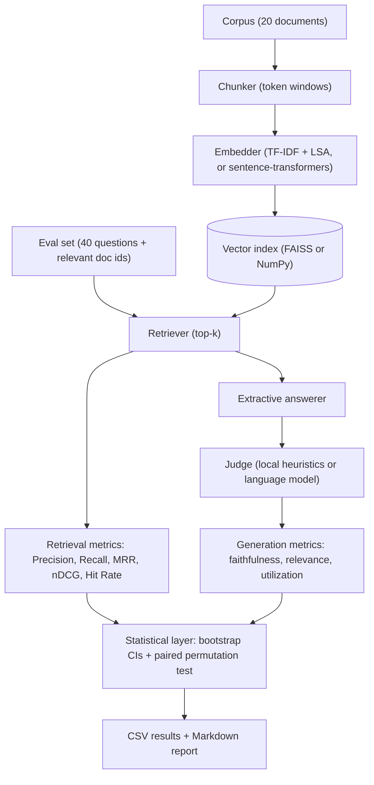

# rag-evaluation-framework

A statistically grounded evaluation framework for retrieval-augmented generation (RAG) pipelines. It scores a pipeline on three levels: retrieval, generation, and statistical significance, and reports every number with a confidence interval and, where two configurations are compared, a p-value. The whole project runs offline with no API keys and no runtime downloads.

## Why this exists

Most RAG evaluations stop at a table of point estimates: "config A gets Recall@5 = 0.82, config B gets 0.79, ship A." On a small evaluation set that conclusion is often noise. A Recall@5 of 0.82 measured on 40 questions could easily be 0.72 or 0.90 on a different 40 questions, and a 0.03 gap between two configs may vanish under resampling.

This framework treats evaluation as a measurement problem:

- Every metric is reported as a **mean with a bootstrap confidence interval**, so you can see how precisely it is known.
- Every A-vs-B comparison is run through a **paired permutation test**, so "A is better than B" is only claimed when the difference survives a hypothesis test on the same questions.
- The retrieval metrics are pure functions checked against **hand-computed values** in the test suite, so the arithmetic is trustworthy.

The demo below shows the payoff directly: shrinking the embedding drops point-estimate Recall@1 by ten points, yet the permutation test declines to call it significant on 40 questions, exactly the over-claim the statistical layer is designed to catch.

## Architecture



The package is layered so the parts that need to be correct are isolated from the parts that need external services:

| Layer | Module | External dependency |
| --- | --- | --- |
| Retrieval metrics | `rag_eval.metrics.retrieval` | none (pure functions) |
| Generation metric formulas | `rag_eval.metrics.generation` | NumPy only |
| Statistics | `rag_eval.stats` | NumPy only |
| Embeddings | `rag_eval.embeddings` | scikit-learn (offline) / optional sentence-transformers |
| Pipeline (chunk, index, retrieve, answer) | `rag_eval.pipeline` | FAISS |
| Judges | `rag_eval.judges` | none (local) / HTTP (language-model backend) |
| Runner, report, CLI | `rag_eval.experiment`, `rag_eval.report`, `rag_eval.__main__` | none |

## Installation

Python 3.10 or newer.

```bash
pip install -e .
# or: pip install -r requirements.txt
```

Core dependencies are NumPy, scikit-learn, FAISS and PyYAML. The optional dense embedding backend (`pip install -e ".[dense]"`) pulls in `sentence-transformers`; it is not needed for the demo.

## Quickstart

Run the bundled experiment from the project root:

```bash
python -m rag_eval run --config configs/default.yaml
```

This evaluates three retrieval configurations on the demo corpus and writes four files to `results/`:

- `report.md`: human-readable report with confidence intervals and verdicts.
- `summary.csv`: per-configuration metric means and CIs.
- `comparisons.csv`: every pairwise metric difference, CI and p-value.
- `per_query_metrics.csv`: the raw per-question values behind everything else.

Using the library directly:

```python
from rag_eval.metrics.retrieval import ndcg_at_k
from rag_eval.stats import bootstrap_ci, paired_permutation_test

ndcg_at_k(["d3", "d1", "d7"], relevant={"d1"}, k=3)          # 0.5 (relevant at rank 2)
bootstrap_ci([1, 0, 1, 1, 0, 1], n_boot=10_000, seed=0)      # mean + 95% CI
paired_permutation_test(config_a_scores, config_b_scores)    # p-value for the difference
```

## Metric definitions

### Retrieval metrics

The retriever returns a ranked list of chunks. Chunks are collapsed onto their parent documents (first occurrence wins), giving a ranked list of unique document ids `R = [R_1, R_2, …]`, which is scored against the relevant set `Rel`. Working at the document level is what makes different chunk sizes comparable on the same ground truth.

$$\text{Precision@}k = \frac{|\{R_1,\dots,R_k\} \cap Rel|}{k} \qquad \text{Recall@}k = \frac{|\{R_1,\dots,R_k\} \cap Rel|}{|Rel|}$$

$$\text{HitRate@}k = \mathbb{1}\left[\{R_1,\dots,R_k\} \cap Rel \neq \varnothing\right] \qquad \text{RR} = \frac{1}{\text{rank of first relevant}}, \quad \text{MRR} = \frac{1}{Q}\sum_{q} \text{RR}_q$$

$$\text{DCG@}k = \sum_{i=1}^{k} \frac{rel_i}{\log_2(i+1)} \qquad \text{nDCG@}k = \frac{\text{DCG@}k}{\text{IDCG@}k}$$

where `rel_i` is 1 when the document at rank `i` is relevant (binary relevance; graded gains are also supported), and IDCG is the DCG of the ideal ranking.

### Generation metrics

Let the answer split into sentences `A = {a_i}`, the retrieved context into sentences `C = {c_j}`, and `q` be the question. All similarities are cosine similarities in the judge's embedding space, and `τ` is a support threshold (default 0.5).

$$\text{Faithfulness} = \frac{1}{|A|}\sum_{i} \mathbb{1}\!\left[\max_{j}\cos(a_i, c_j) \ge \tau\right]$$

the fraction of answer sentences supported by some context sentence (a grounding / hallucination proxy).

$$\text{AnswerRelevance} = \operatorname{clamp}_{[0,1]}\!\left(\frac{1}{|A|}\sum_{i}\cos(a_i, q)\right)$$

how well the answer, on average, addresses the question.

$$\text{ContextUtilization} = \frac{1}{|C|}\sum_{j} \mathbb{1}\!\left[\max_{i}\cos(c_j, a_i) \ge \tau\right]$$

the fraction of retrieved context that is actually echoed by the answer (a retrieval-efficiency proxy: low values mean much of what was retrieved went unused).

Two judge backends compute these:

- **Local judge** (default, offline): embeds sentences with a per-example TF-IDF space and applies the formulas above. Deterministic, no network.
- **Language-model judge**: prompts any OpenAI-compatible `/chat/completions` endpoint for the three scores and parses the JSON reply. The network call is isolated behind one method and can be replaced with an injected function, so it is fully mockable and requires no key in tests.

## How the statistical testing works

**Bootstrap confidence intervals.** For a metric with per-question values `x_1,…,x_n`, we draw `B` resamples of size `n` with replacement, recompute the mean of each, and take the empirical 2.5th and 97.5th percentiles as a 95% interval. This makes no normality assumption and answers "how precisely is this mean known?"

**Paired permutation test.** Two configurations are evaluated on the *same* questions, so their per-question scores are paired: `d_i = a_i − b_i`. Under the null hypothesis the two configs are exchangeable for each question, meaning the sign of each `d_i` is equally likely to be positive or negative. We build the null distribution by randomly flipping those signs `B` times and recomputing the mean difference. The two-sided p-value uses the standard Monte-Carlo correction:

$$p = \frac{\#\{\,b : |\bar{d}^{(b)}_{\text{perm}}| \ge |\bar{d}_{\text{obs}}|\,\} + 1}{B + 1}$$

The `+1` keeps the p-value from ever being exactly zero. A difference is called significant at `α = 0.05`, and the confidence interval on the paired difference is itself bootstrapped.

Sign-flipping (rather than shuffling labels between independent groups) is the right procedure here precisely because the evaluation is paired: the same 40 questions run through both configurations.

## Demo results

Real numbers from `python -m rag_eval run --config configs/default.yaml` on the bundled corpus (20 documents, 40 labelled questions, offline TF-IDF + LSA embedder, FAISS index, local judge; 10,000 bootstrap resamples and 10,000 permutations; seed 20240517).

Three retrieval configurations are compared: a `baseline` (128-token chunks, 128-dim LSA), `large_chunks` (256-token chunks), and `low_dim` (an embedding-capacity ablation that shrinks the LSA space to 8 dimensions).

| Metric | baseline | large_chunks | low_dim |
| --- | ---: | ---: | ---: |
| Recall@1 | 0.975 | 0.975 | 0.875 |
| MRR | 1.000 | 1.000 | 0.938 |
| nDCG@5 | 1.000 | 1.000 | 0.947 |
| Hit Rate@5 | 1.000 | 1.000 | 0.975 |
| Faithfulness | 1.000 | 1.000 | 1.000 |
| Answer relevance | 0.169 | 0.183 | 0.124 |
| Context utilization | 0.084 | 0.055 | 0.089 |

Significant comparisons (two-sided paired permutation test, `α = 0.05`):

| Comparison | Metric | Δ (A−B) | 95% CI of Δ | p-value | Verdict |
| --- | --- | ---: | :---: | ---: | --- |
| baseline vs large_chunks | context utilization | +0.030 | [0.019, 0.038] | 0.0001 | baseline significantly higher |
| baseline vs low_dim | answer relevance | +0.045 | [0.019, 0.072] | 0.0015 | baseline significantly higher |

What the run shows:

1. **Chunk size did not change retrieval at all** on this corpus: every retrieval metric is identical for `baseline` and `large_chunks` (the 20 topics are lexically well separated, so retrieval is saturated). It did, however, **significantly change context utilization**: 128-token chunks put a larger share of the retrieved context to use than 256-token chunks (p = 0.0001).
2. **The embedding ablation is the cautionary tale.** Cutting the LSA space to 8 dimensions lowers point-estimate Recall@1 from 0.975 to 0.875 and MRR from 1.000 to 0.938, differences a point-estimate table would happily report. On 40 questions the permutation test returns **p = 0.12: not significant**. The same ablation *does* significantly reduce answer relevance (p = 0.0015), because that metric moves on more questions. Reporting only the headline retrieval drop would have been an over-claim; the framework flags it.
3. **Faithfulness is 1.000 everywhere** because the demo generator is extractive: it composes answers from retrieved sentences, so answers are grounded in context by construction, and the metric correctly reflects that. The language-model judge exists for evaluating genuinely generative pipelines.

The full breakdown, including the many non-significant retrieval rows, is in [`results/report.md`](results/report.md).

## Case study: measuring a production retrieval stack

I also pointed the framework at the retrieval stack of my own PDF chatbot, [DocMind](https://github.com/JAYANSHUBADLANI/rag-pdf-chatbot), which uses dense MiniLM embeddings plus a cross-encoder reranking stage (over-retrieve 12 candidates, rerank with `ms-marco-MiniLM-L-6-v2`, keep the top 5). The question: does each stage of that stack buy a statistically defensible improvement over something simpler, or does it just feel better?

```bash
python -m rag_eval run --config configs/docmind.yaml
```

| Metric | tfidf_baseline | minilm | minilm_rerank |
| --- | ---: | ---: | ---: |
| Recall@5 | 1.000 | 1.000 | 1.000 |
| MRR | 1.000 | 1.000 | 1.000 |
| Answer relevance | 0.169 | 0.186 | 0.186 |
| Context utilization | 0.084 | 0.090 | 0.086 |

Verdicts from the paired permutation tests:

- **TF-IDF vs MiniLM:** dense embeddings look better on answer relevance (+0.017) but the test says **not significant** (p = 0.17) on 40 questions; the point estimate alone would have over-claimed.
- **MiniLM vs MiniLM + reranker:** answer relevance is indistinguishable (p = 0.63), and the reranker actually **significantly lowers context utilization** (p = 0.0005). Document-level retrieval is already saturated on this corpus, so the cross-encoder stage has nothing left to fix.

The honest conclusion: on well-separated topics the extra stages of the production stack are not measurable wins, and the framework says so instead of flattering the more complex system. Reranking earns its keep on harder corpora (ambiguous queries over overlapping documents), which is exactly the kind of claim this harness exists to test rather than assume. Full numbers in [`results/docmind/report.md`](results/docmind/report.md).

## Project layout

```
rag-evaluation-framework/
├── src/rag_eval/
│   ├── metrics/          # retrieval.py, generation.py (pure metric definitions)
│   ├── judges/           # base.py, local.py, llm.py (generation scoring backends)
│   ├── embeddings.py     # TF-IDF/LSA and optional dense backends + cosine helpers
│   ├── pipeline.py       # chunking, FAISS/NumPy indexes, retriever, answerer
│   ├── stats.py          # bootstrap CIs and paired permutation test
│   ├── dataset.py        # corpus and eval-set loading + validation
│   ├── config.py         # YAML config dataclasses
│   ├── experiment.py     # the runner + CSV writers
│   ├── report.py         # Markdown report generator
│   └── __main__.py       # `python -m rag_eval` CLI
├── demo/
│   ├── corpus/           # 20 short encyclopedia-style .txt documents
│   └── eval_set.json     # 40 questions with relevant document ids
├── configs/              # default.yaml (demo) + docmind.yaml (case study)
├── results/              # generated CSVs + reports (real numbers)
├── tests/                # pytest suite
├── pyproject.toml
├── requirements.txt
└── LICENSE
```

## Configuration

An experiment is a YAML file. Configurations may override the experiment-wide embedder, which is how the embedding ablation is expressed:

```yaml
embedder:
  name: tfidf
  svd_dim: 128
configs:
  - name: baseline
    chunk_size: 128
    overlap: 20
    top_k: 5
  - name: low_dim
    chunk_size: 128
    overlap: 20
    top_k: 5
    embedder: { name: tfidf, svd_dim: 8 }   # per-config override
comparisons:
  - [baseline, low_dim]
```

To use the dense embedding backend, install the extra and set:

```yaml
embedder:
  name: sentence-transformers
  model_name: sentence-transformers/all-MiniLM-L6-v2
```

A configuration becomes two-stage when it names a cross-encoder: `rerank_candidates` chunks are retrieved from the vector index, re-scored jointly with the query, and the top `top_k` survivors are kept:

```yaml
configs:
  - name: minilm_rerank
    chunk_size: 128
    overlap: 20
    top_k: 5
    embedder: { name: sentence-transformers }
    rerank_model: cross-encoder/ms-marco-MiniLM-L-6-v2
    rerank_candidates: 12
```

## Testing

```bash
pytest
```

The suite (72 tests) covers every retrieval and generation metric against hand-computed expected values, the bootstrap and permutation functions, both judge backends (the language-model judge with an injected chat function, so no network is used), the chunker and both vector indexes, dataset validation, retrieval config validation, and end-to-end runs (including a reranked configuration) plus the CLI on a tiny fixture.

## Limitations

- **The offline metrics are proxies.** The local judge approximates entailment with embedding cosine similarity and a threshold; it is fast and reproducible but coarser than a strong language-model judge or a trained NLI model. Absolute generation scores depend on the embedding backend, so treat them as relative signals between configurations rather than calibrated probabilities.
- **"Higher is better" is assumed for every metric.** Context utilization in particular is a proxy for retrieval efficiency, not an unqualified good; a very high value can also mean too little context was retrieved. Interpret it alongside the retrieval metrics.
- **Document-level relevance.** The demo labels relevance at the document level so chunk sizes are comparable. Passage-level or graded relevance judgments would give finer-grained retrieval scores (the nDCG implementation already accepts graded gains).
- **The demo corpus is easy on purpose.** Twenty well-separated topics make retrieval saturate, which is what surfaces the "large effect size, not significant" lesson; it is not a claim about difficulty on real corpora.
- **The permutation test assumes exchangeable, paired questions** and, like any test, loses power on small evaluation sets, as the embedding ablation demonstrates.

## License

Released under the MIT License. See [LICENSE](LICENSE).
